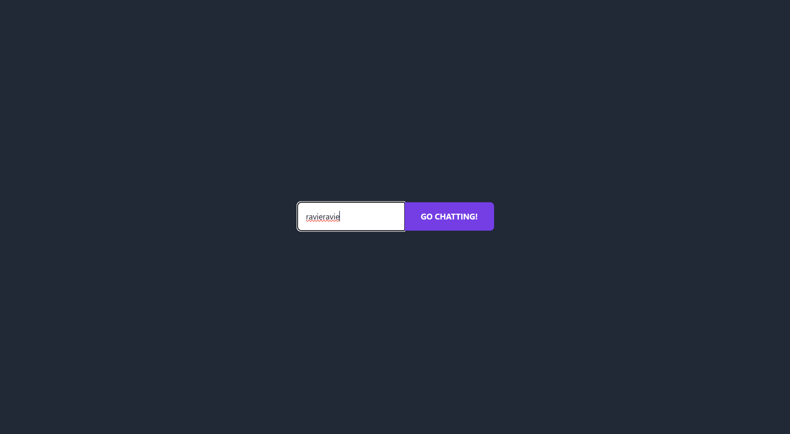
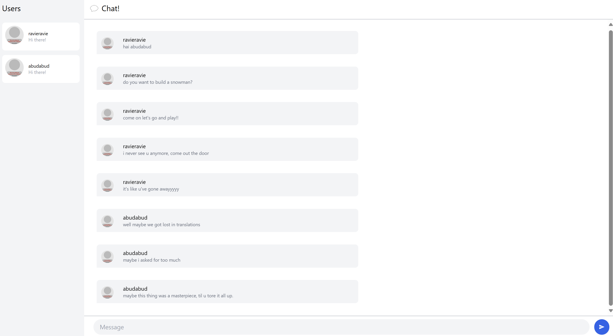
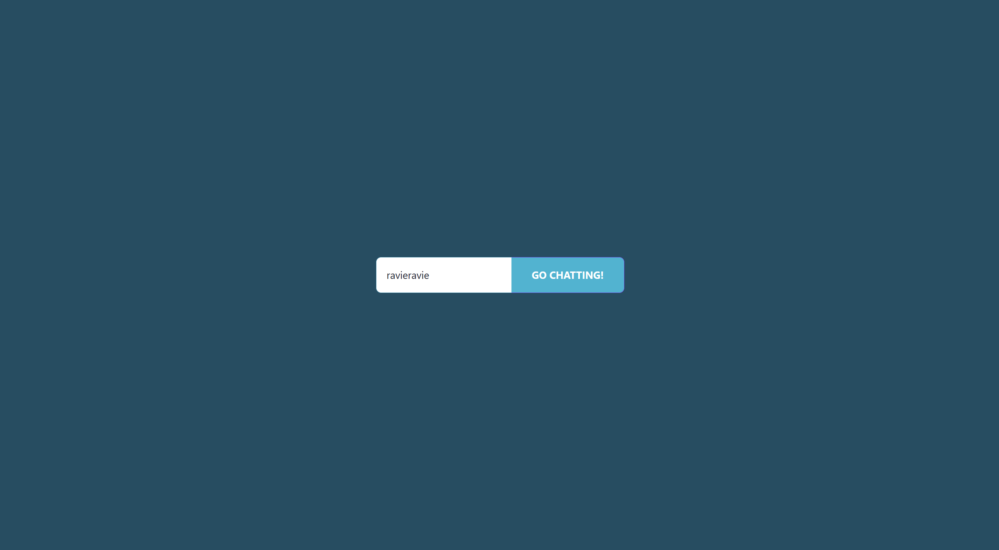
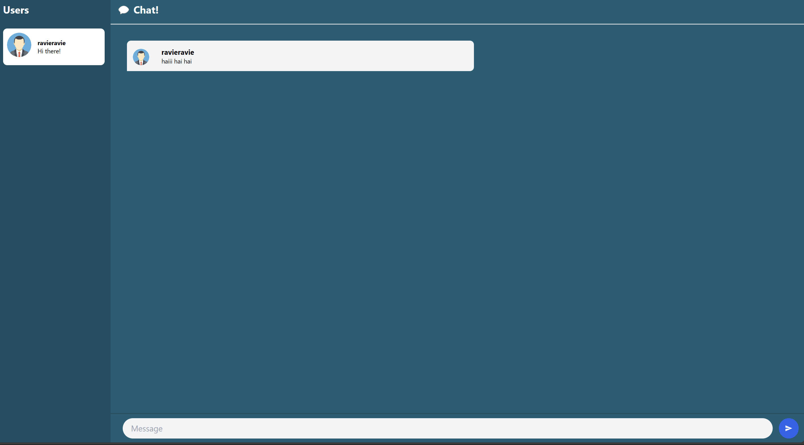
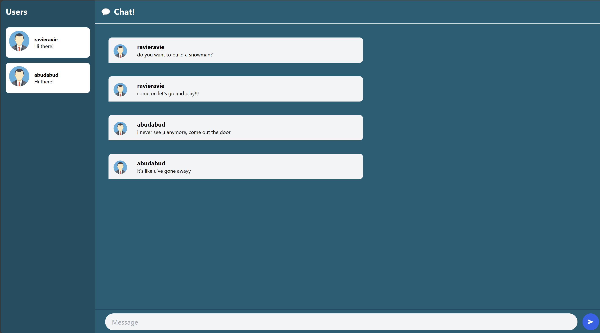

# Reflection Notes

### 3.1. Original code

Tampilan page ketika pengguna pertama kali membuka aplikasi dan mengisi username untuk bisa lanjut chat. Pada contoh ini username penggunanya adalah "ravieravie": <br>


Tampilan page ketika pengguna sukses masuk dan mulai mengirimkan pesan. Pada contoh ini adalah pengguna dengan username "ravieravie": <br>


Tampilan page ketika ada beberapa pengguna yang bertukar pesan satu sama lain. Pada contoh ini adalah pengguna dengan username "ravieravie" dan "abudabud": <br>


### 3.2 Add some creativities to the webclient

Setelah saya ubah tampilannya bertemakan warna cyan, menjadi seperti berikut:

Tampilan page ketika pengguna pertama kali membuka aplikasi dan mengisi username untuk bisa lanjut chat. Pada contoh ini username penggunanya adalah "ravieravie": <br>


Tampilan page ketika pengguna sukses masuk dan mulai mengirimkan pesan. Pada contoh ini adalah pengguna dengan username "ravieravie": <br>


Tampilan page ketika ada beberapa pengguna yang bertukar pesan satu sama lain. Pada contoh ini adalah pengguna dengan username "ravieravie" dan "abudabud": <br>


# YewChat 💬

> Source code for [Let’s Build a Websocket Chat Project With Rust and Yew 0.19 🦀](https://fsjohnny.medium.com/lets-build-a-websockets-project-with-rust-and-yew-0-19-60720367399f)

## Install

1. Install the required toolchain dependencies:
   ```npm i```

2. Follow the YewChat post!

## Branches

This repository is divided to branches that correspond to the blog post sections:

* main - The starter code.
* routing - The code at the end of the Routing section.
* components-part1 - The code at the end of the Components-Phase 1 section.
* websockets - The code at the end of the Hello Websockets! section.
* components-part2 - The code at the end of the Components-Phase 2 section.
* websockets-part2 - The code at the end of the WebSockets-Phase 2 section.
